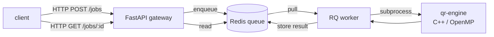

# qropenmp-distributed

Distributed QR decomposition service. A C++/OpenMP engine (Householder reflections)
sits behind a job queue: clients submit matrices over HTTP, jobs are dispatched
to a pool of workers, and results come back through Redis. Designed to be a
self-contained Docker Compose stack — clone, `docker compose up`, done.

The C++ kernel is taken from [qropenmp](https://github.com/himeuru/qropenmp);
this repo wraps it in a small service so the parallel decomposition can be
driven from any HTTP client and scaled horizontally.

## Architecture



Three things share one Compose file:

- **`api`** — FastAPI service that validates requests, enqueues jobs, and serves status.
- **`worker`** — RQ worker container that calls the C++ `qr-engine` binary as a subprocess. Scales horizontally.
- **`redis`** — broker and result store.

## Run

Prerequisites: Docker Desktop. Nothing else.

```bash
git clone https://github.com/himeuru/qropenmp-distributed.git
cd qropenmp-distributed
docker compose up -d --build
```

Open `http://localhost:8000/docs` to explore the API in Swagger UI.

Submit a matrix from inside Compose (no Python on the host needed):

```bash
docker compose run --rm client --n 512 --threads 4
```

Scale the worker pool:

```bash
docker compose up -d --scale worker=4
```

Tear everything down:

```bash
docker compose down -v
```

## API

| Method | Path | Body | Result |
|---|---|---|---|
| `GET` | `/health` | — | service + queue status |
| `POST` | `/jobs` | `{n, threads, matrix_b64}` | `{job_id, status}` (202) |
| `GET` | `/jobs/{id}` | — | `{status, result, timings}` |

Example with `curl`:

```bash
# Submit a tiny 4×4 identity matrix
matrix=$(python3 -c "import struct,base64,sys; m=[1 if i==j else 0 for i in range(4) for j in range(4)]; sys.stdout.write(base64.b64encode(struct.pack('<16d', *m)).decode())")
curl -s -X POST http://localhost:8000/jobs \
  -H "Content-Type: application/json" \
  -d "{\"n\":4,\"threads\":2,\"matrix_b64\":\"$matrix\"}"
```

Poll the returned `job_id`:

```bash
curl -s http://localhost:8000/jobs/<job_id> | jq
```

## Wire format

Matrices cross the wire as base64-encoded little-endian `float64`, row-major,
exactly `n * n * 8` bytes. The worker re-frames this as a binary stream to the
C++ engine:

```
stdin  →  int32 n, int32 threads, double matrix[n*n]
stdout →  double elapsed_ms, int32 n, int32 threads_used, double diag_R[n]
```

The engine returns the diagonal of R for verification (it's small and proves the
decomposition ran). Returning full Q/R is straightforward to add but blows up
the queue for large `n`.

## Repository layout

```
engine/      C++ kernel (qr_decompose) + CLI binary (qr-engine)
api/         FastAPI HTTP gateway
worker/      RQ worker + Dockerfile that builds the engine into its image
client/      Python client (numpy + stdlib), containerized
docker-compose.yml
.github/workflows/build.yml   CI: build images, smoke test end-to-end
```

## Development

Each service has its own Dockerfile; `worker/Dockerfile` is multi-stage and
includes the C++ build. The engine source has its own CMake target so you can
build and test it standalone:

```bash
cmake -S engine -B engine/build -DCMAKE_BUILD_TYPE=Release
cmake --build engine/build -j
```

## License

MIT.
