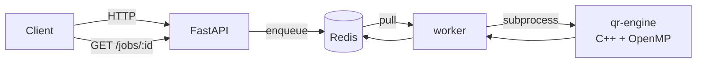

# qropenmp-distributed

QR decomposition (Householder + OpenMP) behind an HTTP API. Matrices are
submitted to FastAPI, queued in Redis, and picked up by a pool of workers
that run the C++ engine. Stack starts with one `docker compose up`.

The C++ engine is the one from [qropenmp](https://github.com/himeuru/qropenmp);
this repo wraps it into a small distributed service.

## Architecture



Three Compose services: `api`, `worker`, `redis`.

## Run

```bash
git clone https://github.com/himeuru/qropenmp-distributed.git
cd qropenmp-distributed
docker compose up -d --build
```

- Web UI: `http://localhost:8000/`
- Swagger: `http://localhost:8000/docs`

Send a job from the CLI client (containerised, no Python on the host needed):

```bash
docker compose run --rm client --n 512 --threads 4
```

Scale workers:

```bash
docker compose up -d --scale worker=4
```

## API

| Method | Path | Body | Result |
|---|---|---|---|
| GET | `/health` | — | service + queue status |
| POST | `/jobs` | `{n, threads, matrix_b64}` | `{job_id}` |
| POST | `/jobs/random` | `{n, threads, seed}` | `{job_id}` (matrix made on the worker) |
| GET | `/jobs/{id}` | — | status + result |

The result has `elapsed_ms`, `threads_used`, and the diagonal of R for
verification. Full Q and R aren't returned to keep Redis lean — easy to add
behind a flag.

## Wire format

Matrix bytes go over the wire as base64 of little-endian `float64`, row-major,
exactly `n*n*8` bytes. The worker reframes it as a binary stream to the engine:

```
stdin:  int32 n, int32 threads, double matrix[n*n]
stdout: double elapsed_ms, int32 n, int32 threads_used, double diag_R[n]
```

## Layout

```
engine/    C++ kernel + CLI binary
api/       FastAPI gateway + static web UI
worker/    RQ worker, shells out to the engine
client/    Python CLI client
.github/   CI: builds images and runs an end-to-end smoke test
```

Engine builds standalone:

```bash
cmake -S engine -B engine/build -DCMAKE_BUILD_TYPE=Release
cmake --build engine/build -j
```
